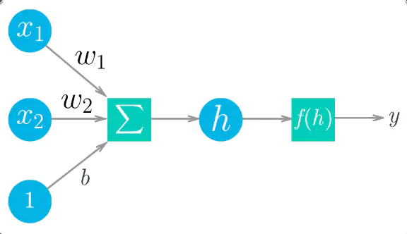
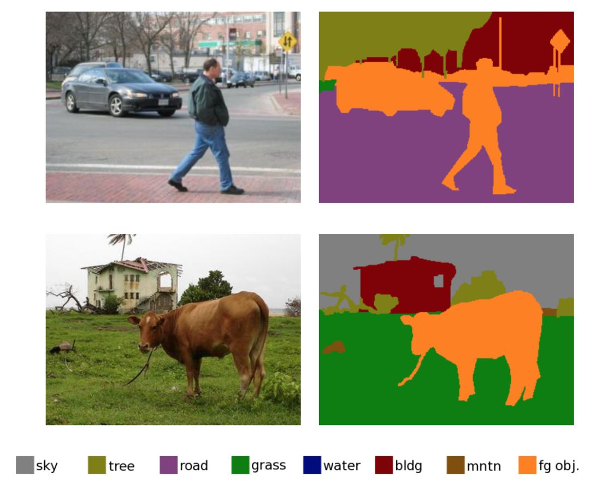
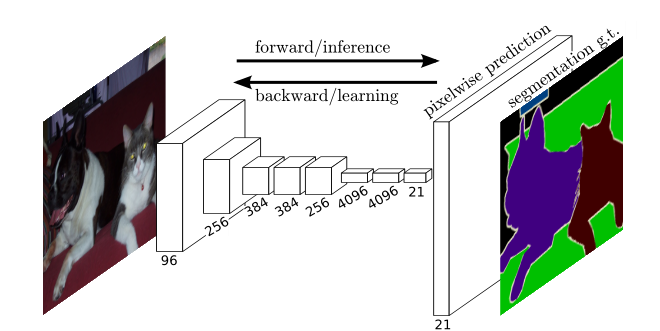
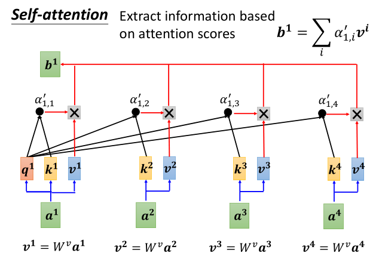
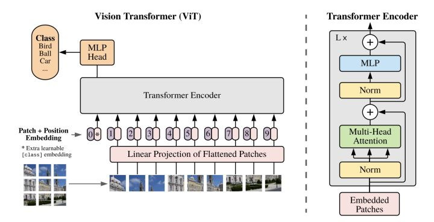

# 1 从最基础的神经网络开始
<div align="center">

<br>
图1 单个神经元
</div>

上图给出展示了一个简单的神经网络。权重、输入和偏置项的线性组合构成了$h=\Sigma w_i x_i +b$，再通过激活函数$f(h)$做一个映射，给出感知器最终的输出，标记为$y$. 把上图中间三个元素看成一个整体，当作一个神经元，对这个神经元来说，输入是一系列值$x\in R^n$,输出是一个具体的数值$y\in R$.

<div align="center">

<br>
图2 多层神经网络
</div>

一般多层神经网络比较常用。最开始接受外界输入的一层神经元被成为输入层，最后一层输出最终结果的神经元被成为输出层，中间的神经元都被称为隐藏层。每一层都由若干个神经元组成，并且上一层神经元的输出是下一层神经元的输入，每个神经元和图1所作的工作相同(图2没有把隐藏的偏置项$b$画出来，每一层神经网络都有一个偏置项)。这种神经网络的运算形式可以使用矩阵表示(H是隐藏神经元)：
$$
H = X\times W_1 + b_1
$$

这里可以看出激活函数的必要性，因为如果没有一个非线性的激活函数，那么多层神经网络经过类似的矩阵运算后还是一个线性映射，用公示表示为：

$$
Y = H \times W_2 + b_2 \\
Y = (X \times W_1 + b_1)\times W_2 + b_2 => Y = X \times W_1 \times W_2 + new\_b
$$

这样增加整个网络的非线性，我们引入激活函数：

<div align="center">

<br>
图3 激活函数
</div>

非常经典的激活函数是Sigmoid，这个激活函数可以把任意一个实数映射到区间$(0,1)$，经过适当调整，也就可以把数映射到任意大小的区间了；现在最常用的激活函数是ReLu函数，这个函数可以小于0的数映射为0，大于0的数映射为它本身。在现代深度学习网络中，ELU激活函数也相对比较常用。

可以说，激活函数往往是一个非常简单的函数，起到一个非线性映射的作用。一般来说，三层神经网络可以逼近如何一个非线性函数。[参考](https://www.zhihu.com/question/344962955)

在这里我们还需要特别介绍一下softmax运算，这是一个必须要理解的概念。

前面的激活函数只是对一个数就行映射，而softmax是对一组数进行映射，或者说是对一层神经元的输出进行映射。

如果一组数是$x\in R^n$，那么这组数经过softmax映射后就是
$$\frac{e^{x_i}}{\Sigma_j{e^{x_j}}} \quad i=0,1,2,\dots,n-1$$

一个具体的例子是：输入为$x=[3, 1, -3]$，那么经过softmax运算后就变成了$[0.88,0.12,0]$（数值上近似）。显然，这组数的和为$1$，每个位置上的数都是大于0小于1的小数，可以用来表示概率。想想一下，如果一共输出三个神经元，这三个输出神经元就可以当作三个类别，哪个神经元的输出值越大，就代表输入属于这个概率越大。至于为什么要用一个指数运算处理下，不是直接用他们相对大小，主要是为了让指数运算起一个扩大差异的效果。

总结来说，可以把神经网络当成一个特殊的函数$f(x)$，有一个输入，它会产生一个输出。输入数据的维度和输出数据的维度都可以按自己的要求调整。

深度学习一般是有监督的学习。也就说我们需要知道样本的真实标签。更形式地说就是我们的训练样本应该是$[X,Y]$，通过我们的网络$f()$映射后可以得到$\hat{Y}=f(x)$，这样我们就有了目标样本$Y$和预测$\hat{Y}$,显然两者应该越相似越好，我们的目标就是想让两者非常接近。那么如果衡量真实标签和预测标签的距离呢？常用的方式有：MSE（均方误差），Cross Entropy Error(交叉熵损失，常用在分类任务)。

实际训练网络的时候，是一批、一批来训练的，网络每次的输入不是一个样本，而是一批样本，常用的128，256个样本当作一批。

如果知道了我们目前的模型在一批数据下的表现与目标差了多远，这个多远可以用一个数值来衡量，然后我们就可以使用误差的反向传播进行梯度下降法更新网络参数。显然的深度学习框架把这些功能封装的都很好，我们并不需要手动实现这些具体的步骤，只要不断调用框架提供的函数接口就可以。可以把注意力更多地放在网络的构建上面。

而所谓深度学习，就是隐藏层很多的、足够深的神经网络。

<div align="center">

<br>
图4 深度神经网络
</div>

下面，我们再给出网络的训练流程：
```python
import torch
import torchvision
import torch.nn as nn
from model import LeNet
import torch.optim as optim
import torchvision.transforms as transforms


def main():
    # 构造数据预处理方式
    transform = transforms.Compose(
        [transforms.ToTensor(),
         transforms.Normalize((0.5, 0.5, 0.5), (0.5, 0.5, 0.5))])

    # 第一次使用时要将download设置为True才会自动去下载数据集
    # 加载数据集
    train_set = torchvision.datasets.CIFAR10(root='./data', train=True,
                                             download=False, transform=transform)
    # 把加载训练数据集变成可以一批一批数据加载的数据
    train_loader = torch.utils.data.DataLoader(train_set, batch_size=36,
                                               shuffle=True, num_workers=0)

    # 加载验证数据集
    val_set = torchvision.datasets.CIFAR10(root='./data', train=False,
                                           download=False, transform=transform)
    val_loader = torch.utils.data.DataLoader(val_set, batch_size=5000,
                                             shuffle=False, num_workers=0)
    val_data_iter = iter(val_loader)
    val_image, val_label = val_data_iter.next()
    
    # 实例化一个网络
    net = LeNet()
    # 指定误差计算方式
    loss_function = nn.CrossEntropyLoss()
    # 网络参数优化器
    optimizer = optim.Adam(net.parameters(), lr=0.001)
    # 一共训练5轮
    for epoch in range(5):  # loop over the dataset multiple times

        running_loss = 0.0
        # 每一轮需要多次加载批量数据，比如说总共10000个样本，一批100，那么需要加载100批才能把所有数据训练一遍
        for step, data in enumerate(train_loader, start=0):
            # get the inputs; data is a list of [inputs, labels]
            inputs, labels = data

            # zero the parameter gradients
            optimizer.zero_grad()
            # forward + backward + optimize
            outputs = net(inputs)
            # 计算这个批量的训练误差
            loss = loss_function(outputs, labels)
            # 误差的反向传播，求每个参数的梯度
            loss.backward()
            # 更新网络参数
            optimizer.step()

    print('Finished Training')

    # 保存训练好的模型
    save_path = './Lenet.pth'
    torch.save(net.state_dict(), save_path)

if __name__ == '__main__':
    main()
```

# 2 LeNet
它是最早发布的卷积神经网络之一，因其在计算机视觉任务中的高效性能而受到广泛关注。 这个模型是由AT&T贝尔实验室的研究员Yann LeCun在1989年提出的（并以其命名），目的是识别图像 [LeCun et al., 1998]中的手写数字。 当时，Yann LeCun发表了第一篇通过反向传播成功训练卷积神经网络的研究，这项工作代表了十多年来神经网络研究开发的成果。 LeNet被广泛用于自动取款机（ATM）机中，帮助识别处理支票的数字。 时至今日，一些自动取款机仍在运行Yann LeCun和他的同事Leon Bottou在上世纪90年代写的代码。

<div align="center">

<br>
图5 LeNet
</div>

要看懂这个网络，需要先了解下面的一些知识：
#### 图片的数据格式

一张图片就是多个矩阵。对于一张尺寸为高和宽$100\times100$的图片，比较常用的格式是RGB格式，也就说这张图片有三个通道，分别是红色通道，绿色通道，蓝色通道，每个通道上是$100\times 100$的矩阵。矩阵上的每个值都是在[0,255]之间。也就是说，一张图片的数据形状是$3\times H\times W$，那一个批量的数据大小就是$Batch \times3\times H\times W$. 简单理解一下，图片就是一堆数字罢了。

#### 卷积运算

简单说卷积操作就是：有一个输入矩阵，有一个卷积核（也是一个矩阵），卷积核在输入矩阵上滑动，卷积核和输入的时候对应位置相乘再相加求和就是这次卷积运算的返回的结果。

输入输出都是一个通道：

<div align="center">

<br>
图6 卷积操作
</div>

动态的看这个卷积过程就是：

<div align="center">

<br>
图7 卷积操作
</div>

输入两个通道，输出一个通道：

<div align="center">

<br>
图8 多个输入通道的卷积
</div>

输入三个通道，输出两个通道：

<div align="center">

<br>
图9 多个输入通道、多个输出通道的卷积
</div>

#### 池化层、汇聚层
不改变通道，改变图片的尺寸。一般有最大池化层，平均池化层。

<div align="center">

<br>
图10 最大池化层
</div>

# 3 Pytorch目前最主流的深度学习框架
其他用的比较多的就是tensorflow,keras等。
国产框架有paddlepaddle,oneflow等。
```python
import torch.nn as nn
import torch.nn.functional as F

# 如果把构造网络当成搭积木
class LeNet(nn.Module):
    # 在这里设置所需要的积木
    def __init__(self):
        super(LeNet, self).__init__()
        self.conv1 = nn.Conv2d(3, 16, 5)
        self.pool1 = nn.MaxPool2d(2, 2)
        self.conv2 = nn.Conv2d(16, 32, 5)
        self.pool2 = nn.MaxPool2d(2, 2)
        self.fc1 = nn.Linear(32*5*5, 120)
        self.fc2 = nn.Linear(120, 84)
        self.fc3 = nn.Linear(84, 10)
    # 如何使用积木
    def forward(self, x):
        x = F.relu(self.conv1(x))    # input(3, 32, 32) output(16, 28, 28)
        x = self.pool1(x)            # output(16, 14, 14)
        x = F.relu(self.conv2(x))    # output(32, 10, 10)
        x = self.pool2(x)            # output(32, 5, 5)
        x = x.view(-1, 32*5*5)       # output(32*5*5)
        x = F.relu(self.fc1(x))      # output(120)
        x = F.relu(self.fc2(x))      # output(84)
        x = self.fc3(x)              # output(10)
        return x
```


# 4 AlexNet
在LeNet提出后，卷积神经网络在计算机视觉和机器学习领域中很有名气。但卷积神经网络并没有主导这些领域。这是因为虽然LeNet在小数据集上取得了很好的效果，但是在更大、更真实的数据集上训练卷积神经网络的性能和可行性还有待研究。事实上，在上世纪90年代初到2012年之间的大部分时间里，神经网络往往被其他机器学习方法超越，如支持向量机（support vector machines）。

2012年，AlexNet横空出世。它首次证明了学习到的特征可以超越手工设计的特征。它一举打破了计算机视觉研究的现状。 AlexNet使用了8层卷积神经网络，并以很大的优势赢得了2012年ImageNet图像识别挑战赛。

AlexNet的出现掀起了深度学习的浪潮！

<div align="center">

<br>
图11 从LeNet(左)到AlexNet(右)
</div>

lexNet和LeNet的设计理念非常相似，但也存在显著差异。 首先，AlexNet比相对较小的LeNet5要深得多。 AlexNet由八层组成：五个卷积层、两个全连接隐藏层和一个全连接输出层。 其次，AlexNet使用ReLU而不是sigmoid作为其激活函数。 下面，让我们深入研究AlexNet的细节。

此外，AlexNet将sigmoid激活函数改为更简单的ReLU激活函数。 一方面，ReLU激活函数的计算更简单，它不需要如sigmoid激活函数那般复杂的求幂运算。 另一方面，当使用不同的参数初始化方法时，ReLU激活函数使训练模型更加容易。 当sigmoid激活函数的输出非常接近于0或1时，这些区域的梯度几乎为0，因此反向传播无法继续更新一些模型参数。 相反，ReLU激活函数在正区间的梯度总是1。 因此，如果模型参数没有正确初始化，sigmoid函数可能在正区间内得到几乎为0的梯度，从而使模型无法得到有效的训练。

# 5 VGG

虽然AlexNet证明深层神经网络卓有成效，但它没有提供一个通用的模板来指导后续的研究人员设计新的网络。

经典卷积神经网络的基本组成部分是下面的这个序列：
1. 带填充以保持分辨率的卷积层；
2. 非线性激活函数，如ReLU；
3. 汇聚层，如最大汇聚层。

而一个VGG块与之类似，由一系列卷积层组成，后面再加上用于空间下采样的最大汇聚层 [Simonyan & Zisserman, 2014](https://arxiv.org/abs/1409.1556)。作者使用了带有卷积核、填充为1（保持高度和宽度）的卷积层，和带有汇聚窗口、步幅为2（每个块后的分辨率减半）的最大汇聚层。

```python
def vgg_block(num_convs, in_channels, out_channels):
    layers = []
    for _ in range(num_convs):
        layers.append(nn.Conv2d(in_channels, out_channels,
                                kernel_size=3, padding=1))
        layers.append(nn.ReLU())
        in_channels = out_channels
    layers.append(nn.MaxPool2d(kernel_size=2,stride=2))
    return nn.Sequential(*layers)
```

<div align="center">


<br>
图12 VGG16
</div>

# 6 GoogLeNet 含并行连结的网络

以前流行的网络使用小到1x1，大到11x11的卷积核。 GoogLeNet的一个观点是，有时使用不同大小的卷积核组合是有利的。

在GoogLeNet中，基本的卷积块被称为Inception块（Inception block）。这很可能得名于电影《盗梦空间》（Inception），因为电影中的一句话“我们需要走得更深”（“We need to go deeper”）。

<div align="center">

<br>
图13 inception结构
</div>

GoogLeNet一共使用9个Inception块和全局平均汇聚层的堆叠来生成其估计值。Inception块之间的最大汇聚层可降低维度。 第一个模块类似于AlexNet和LeNet，Inception块的组合从VGG继承，全局平均汇聚层避免了在最后使用全连接层。

<div align="center">

<br>
图14 GoogLetNet
</div>

# 7 ResNet残差网络

按理说，较深的网络肯定会比较浅的网络性能，最差的情况深网络也不应该比浅网络性能差。如果浅网络是$f(x)$，那么加深这个网络就会得到$g(f(x))$，在$g(x)$为恒等函数的情况下，两者应该是相等的。但目前网络具体表现上并不是这样，过深的网络性能甚至会下降很多。这篇文章之前的解释是梯度消失和梯度爆炸。

神经网络的参数更新要用到导数的链式法则，链式法则也就是多个中间变量之间的求导，如果这个值大于0小于1，那么若干次相乘后就会接近1，梯度近乎0了就不会更新参数；如果这个值大于1，那么若干次相乘后就会很大，发生梯度爆炸现象。

$$
\begin{aligned}
&\frac{\partial C}{\partial b_{1}}=\frac{\partial C}{\partial y_{4}} \frac{\partial y_{4}}{\partial z_{4}} \frac{\partial z_{4}}{\partial x_{4}} \frac{\partial x_{4}}{\partial z_{3}} \frac{\partial z_{3}}{\partial x_{3}} \frac{\partial x_{3}}{\partial z_{2}} \frac{\partial z_{2}}{\partial x_{2}} \frac{\partial x_{2}}{\partial z_{1}} \frac{\partial z_{1}}{\partial b_{1}} \\
&=\frac{\partial C}{\partial y_{4}} \sigma^{\prime}\left(z_{4}\right) w_{4} \sigma^{\prime}\left(z_{3}\right) w_{3} \sigma^{\prime}\left(z_{2}\right) w_{2} \sigma^{\prime}\left(z_{1}\right)
\end{aligned}
$$

但何凯明觉得很多正则化处理方式已经可以很大程度上的避免了这个问题，那是如果解决这种网络退化的问题呢？[He et al., 2016a](https://arxiv.org/abs/1512.03385) 这篇文章谷歌学术引用量超过11万，强烈推荐阅读！

ResNet核心在于引入了残差块，使不同层的网络可以跳跃式连接：

<div align="center">

<br>
图15 一个正常块（左图）和一个残差块（右图）
</div>

ResNet沿用了VGG完整的卷积层设计。 残差块里首先有2个有相同输出通道数的3x3卷积层。 每个卷积层后接一个批量规范化层和ReLU激活函数。 然后我们通过跨层数据通路，跳过这2个卷积运算，将输入直接加在最后的ReLU激活函数前。 这样的设计要求2个卷积层的输出与输入形状一样，从而使它们可以相加。 如果想改变通道数，就需要引入一个额外的1x1卷积层来将输入变换成需要的形状后再做相加运算。 残差块的实现如下：

```python
class Residual(nn.Module):  #@save
    def __init__(self, input_channels, num_channels,
                 use_1x1conv=False, strides=1):
        super().__init__()
        self.conv1 = nn.Conv2d(input_channels, num_channels,
                               kernel_size=3, padding=1, stride=strides)
        self.conv2 = nn.Conv2d(num_channels, num_channels,
                               kernel_size=3, padding=1)
        if use_1x1conv:
            self.conv3 = nn.Conv2d(input_channels, num_channels,
                                   kernel_size=1, stride=strides)
        else:
            self.conv3 = None
        self.bn1 = nn.BatchNorm2d(num_channels)
        self.bn2 = nn.BatchNorm2d(num_channels)

    def forward(self, X):
        Y = F.relu(self.bn1(self.conv1(X)))
        Y = self.bn2(self.conv2(Y))
        if self.conv3:
            X = self.conv3(X)
        Y += X
        return F.relu(Y)
```

<div align="center">

<br>
图16 包含以及不包含1x1卷积层的残差块。
</div>

ResNet的前两层跟之前介绍的GoogLeNet中的一样： 在输出通道数为64、步幅为2的卷积层后，接步幅为2的的最大汇聚层。 不同之处在于ResNet每个卷积层后增加了批量规范化层。

<div align="center">

<br>
图17 ResNet-18 架构
</div>

# 8 MobileNet

这篇论文是谷歌在2017年提出了，专注于移动端或者嵌入式设备中的轻量级CNN网络。该论文最大的创新点是，提出了深度可分离卷积（depthwise separable convolution）.

简单来说，MobileNet v1就是将常规卷积替换为深度可分离卷积的VGG网络。

#### depthwise卷积（DW卷积）

<div align="center">

<br>
图18 DW卷积
</div>

不同于常规卷积操作，Depthwise Convolution的一个卷积核负责一个通道，一个通道只被一个卷积核卷积。上面所提到的常规卷积每个卷积核是同时操作输入图片的每个通道。

同样是对于一张5×5像素、三通道彩色输入图片（shape为5×5×3），Depthwise Convolution首先经过第一次卷积运算，不同于上面的常规卷积，DW完全是在二维平面内进行。卷积核的数量与上一层的通道数相同（通道和卷积核一一对应）。所以一个三通道的图像经过运算后生成了3个Feature map(如果有same padding则尺寸与输入层相同为5×5)，如图18所示。

#### Pointwise卷积

<div align="center">

<br>
图19 Pointwise卷积
</div>

Pointwise Convolution的运算与常规卷积运算非常相似，不同之处在于卷积核的尺寸为 1×1×M，M为上一层的depth。所以这里的卷积运算会将上一步的map在深度方向上进行加权组合，生成新的Feature map。有几个Filter就有几个Feature map。如下图所示。

#### 多个版本

这样的结构可以降低参数数量，深度可分离卷积的参数约是常规卷积的三分之一。

MobileNet v1的特色就是深度可分离卷积，但研究人员发现深度可分离卷积中有大量卷积核为0，即有很多卷积核没有参与实际计算。是什么原因造成的呢？v2的作者发现是ReLU激活函数的问题，认为ReLU这个激活函数，在低维空间运算中会损失很多信息，而在高维空间中会保留较多有用信息。

既然如此，v2的解决方案也很简单，就是直接将ReLU6激活换成线性激活函数，当然也不是全都换，只是将最后一层的ReLU换成线性函数。具体到v2网络中就是将最后的Point-Wise卷积的ReLU6都换成线性函数。v2给这个操作命名为linear bottleneck，这也是v2网络的第一个关键点。

# 9 DenseNet稠密网络

ResNet极大地改变了如何参数化深层网络中函数的观点。 稠密连接网络（DenseNet）在某种程度上是ResNet的逻辑扩展。

<div align="center">

<br>
图20 ResNet（左）与 DenseNet（右）在跨层连接上的主要区别：使用相加和使用连结
</div>

<br>
所谓稠密连接，也就是每一层的输出与后续所有层直接连接。

<div align="center">

<br>
图21 稠密连接
</div>

# 10 常见迁移学习的方式

1. 载入权重后训练所有参数
2. 载入权重后只训练最后几层参数
3. 载入权重后在原网络基础上再添加一层全连接层，仅训练最后一个全连接层。（微调Fine-Tune）

# 11 语义分割里程碑之作FCN

<div align="center">

<br>
图22 语义分割效果图
</div>

说简单点，语义分割就是要做图像的像素级别的预测，预测图像的每个像素属于哪个类别（包括背景类别）。

#### 转置卷积、反卷积

我们常见的卷积是一种下采样，一般会把图片变小；而转置卷积，可以把图片的大小变大，所以也叫反卷积，是一种上采样的方式，动图展示如下：

<div align="center">

<br>
图23 转置卷积
</div>

<br>
其实转置卷积本质上也是一种卷积操作，不过在原始图片的周围填充了很多的0，导致卷积之后图像尺寸反而变大。

<div align="center">

<br>
图24 全卷积网络（全是卷积层，没有线性层）
</div>

前面提取特征部分的网络就是backbone，是深度学习的上游任务；要做语义分割，只要修改下游任务就可以。原论文用的是VGG16的卷积网络部分，在VGG中经过多次池化操作后图像大小变为原来的$\frac{1}{32}$，这时候使用上采样扩大32倍，图像的尺寸就变为原来的大小了。图像的通道还需要变为我们的类别数（常规类别数+1背景），然后在通道的维度上做softmax运算就知道每个像素属于的类别。

到这里，我们应该就明白了分类网络和其他图像任务之间的关系了。可以说，图像分类网络是最核心的任务，每一次分类网络的进化也会带动其他图像任务的进步。

# 12 循环神经网络

#### 文本的编码

I love USTC!
每个单词要用数字表示，一个样本就是一句话，一句话是多个单词。

假设每个人单词的编码长度是固定的，每个单词用128个数进行编码，那么一批样本的shape就是

$$B\times seq_len \times word\_embeding$$

在处理数据时要做填充操作！

隐藏层的计算方式如下：

$$\mathbf{H}_t = \phi(\mathbf{X}_t \mathbf{W}_{xh} + \mathbf{H}_{t-1} \mathbf{W}_{hh}  + \mathbf{b}_h).$$

<div align="center">

<br>
图25 具有隐状态的循环神经网络
</div>

## 门控卷积网络单元GRU

<div align="center">

<br>
图26 计算门控循环单元模型中的隐状态
</div>

## 长短期记忆网络 LSTM (Long short-term memory)

<div align="center">

<br>
图27 在长短期记忆模型中计算隐状态
</div>

需要注意的是，LSTM翻译为长的短期记忆网络更为合适，从英文就可以看出来，所以还是一种短期记忆网络，对于特别长的序列处理起来还是不太行。

现在一般说循环神经网络，都默认是LSTM。

# 13 序列到序列seq to seq

<div align="center">

<br>
图28 编码器-解码器架构
</div>
<br>
序列到序列就是说输入时一个序列（不定长度），输出也是一个序列（不定长度）。是一种多对多的模型，可以被建模到很多领域。从输入输出上分类，一般就是一对多，多对一，多对多，显然多对多也包含前面的情况的。

# 14 Attention Is All You Need

> https://jalammar.github.io/illustrated-transformer/

参考上述英文博客，写的非常详细。

[Attention is all you need](https://arxiv.org/abs/1706.03762) 必读文章！

广义的transformer是以注意力机制为主的各种网络，狭义的transformer就是有编码器、解码器的结构的网络。

transformer逐渐要称为深度学习的主流，既可以处理语言任务，又可以处理图像任务。目前已经在很多任务上替代了循环神经网络，也越来越多的在很多任务上替代卷积操作。

其核心就是求不同数据的相关矩阵：

<div align="center">

<br>
图29 自注意力机制
</div>

# 15 ViT视觉transformer

<div align="center">

<br>
图30 视觉transformer
</div>
<br>

ViT（20年8月）只用到了transformer中的编码器的结构，也是现代注意力机制首次被用到cv领域，就取得了卓越的效果。 后续越多越多基于注意力机制的网络被用到cv中。


> 参考目录
>
> https://d2l.ai/
>
> https://github.com/WZMIAOMIAO/deep-learning-for-image-processing
>
> https://www.jianshu.com/p/c8adcfda1052
>
> https://www.ibm.com/cn-zh/cloud/learn/neural-networks

